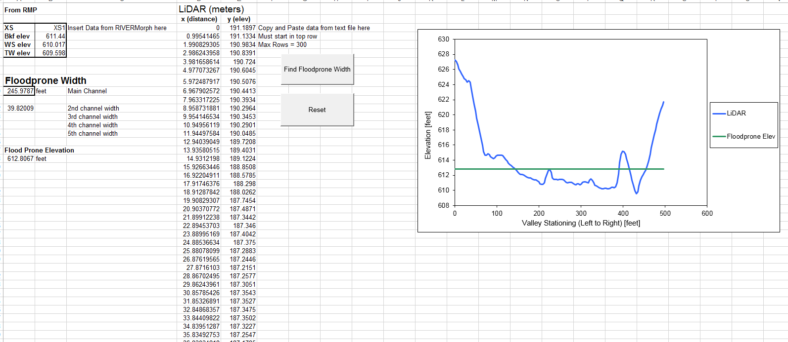
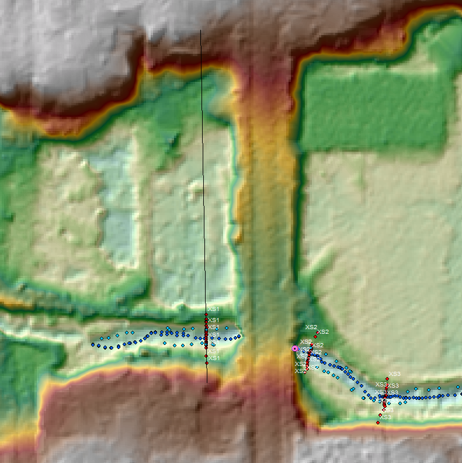
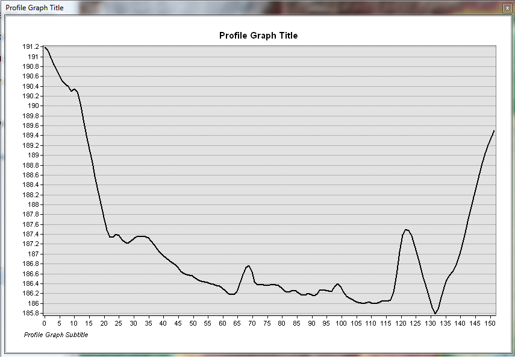

# Floodprone Width
## Synopsis

The scripts within this Microsoft Excel spreadsheet find the floodprone width of a cross-section on a stream.

## Script Inputs

Inputs for this script are LiDAR (or other DEM) stationing and elevation in meters.  The cross-section elevations (bankfull, water surface, and thalweg) are required to find the bankfull max depth.

## Motivation

Floodprone width is used to calculate geomorphic dimensions of streams.  Floodprone width is the elevation at which the cross-section is two times the max bankfull depth of a cross-section.  At this floodprone elevation, the width is calculated.  This used to be performed manually and non-consistently on ArcMap.  Now the data can be pulled and calculated accurately.

## Installation

Download the Microsoft Excel spreadsheet to try the macros out.

## Tests

These scripts were developed with Microsoft Excel 2010 and tested with both Microsoft Excel 2010 & 2013.

## Contributors

Michael Harris is the author of this script.

[StackOverflow] (http://stackoverflow.com/users/4530995/michael-harris)

[LinkedIN] (https://www.linkedin.com/in/michael-harris-366b0060/)

## Acknowledgements

The basIntersection.bas was pulled from the internet back in 2013.  Unfortunately, I didn't think to save the source.

## License

This code is available under the [MIT License.] (LICENSE.txt)

